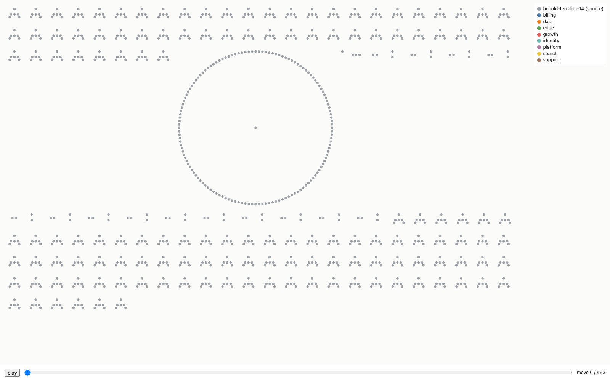
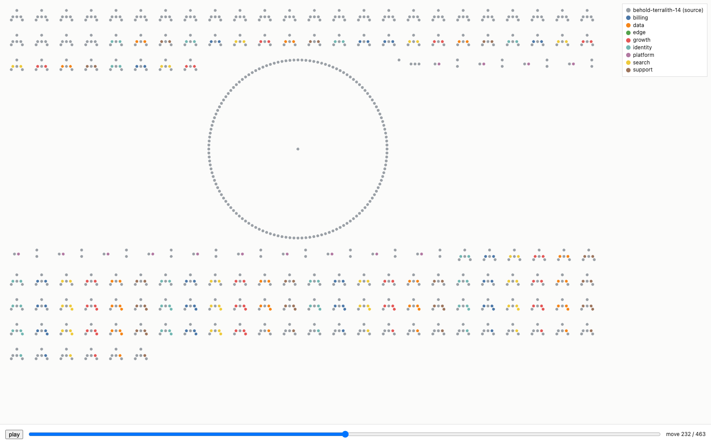
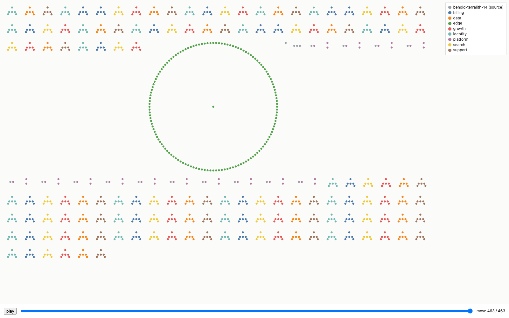

# Dot estates: drawing ~1k resources that record and replay a carve

**Issue:** #457 (research, not implementation) · **Refs** #393, #400

The target is a view with one dot per resource, around 1k of them. It records
an account being carved into estates and replays that. A dot's colour is its
owner, so an ownership change recolours it, and a dot that moves estate may
leave a short trail as an accent. Untaggable children sit around their parent.
This note answers the issue's five questions with measurements, and it closes
with the build issues to open next.

Everything below was measured, not recalled. It can be rerun with the scripts in
`scripts/dot-bench/` against the workbench entry `terralith-14`. The recording
it replays is committed beside the scripts.

## The answers in one table

| Question | Answer |
|---|---|
| 1. Renderer | Canvas 2D, no library: 0.3 ms a frame at 1k, and 1.1 ms with the CPU slowed 4x. SVG breaks first, and today's whole-SVG swap drops frames at 1k on a slow CPU. Hand-written WebGL is the step past about 20k. |
| 2. Layout | A dot's position is a function of its address, never its owner. Resources cluster by unit (a team, a service, the zone), untaggable children ring their parent, and a moving dot recolours in place, so it never takes a new slot. |
| 3. The card graph | The dots are a new zoom stop above `resources`, and they share node ids with the cards, so a click opens the same inspect pane. The replay is a lens on that surface, with its own scrubber. |
| 4. Recording | JSON Lines: a header, a roster from `live-check -json`, owner keyframes from `live-ls`, and one line per `live-mv -json`. Scrubbing starts from the nearest keyframe. It stays apart from `run-playhead`. |
| 5. The estate | `terralith-14`: 1041 resources on floci, applied in 414 s, carved into eight estates by 463 moves, 449 of which landed. |

## 1. Renderer

**Method.** `scripts/dot-bench/run.mjs` drives the installed Google Chrome through Playwright, a devDependency behold already has. One page, `bench.html`, draws N dots through each of six renderers and runs three scenarios for 240 frames each:

| scenario | each frame |
|---|---|
| `recolour` | 10% of the dots take a new colour, as in a replay played fast |
| `travel` | the same recolouring, with 2% of the dots mid-trip to a new slot at any moment |
| `orbit` | every dot moves, the worst case for animated orbiting children |

The page records create time, the renderer's own script time per frame, and the interval from one frame to the next. SVG's style, layout and paint land in that interval, not in script time. It also records hit-test cost over 2,000 random points after the run. The page is served cross-origin isolated so the timers resolve below 100 µs.

A caveat about what the numbers mean: Chrome under automation does not pace frames to the display, headed or headless. A headed pass at 1k and 5k gave the same figures as the headless one within noise. So every number below is the cost of a frame, to be read against a budget of about 17 ms, not a frames-per-second a screen showed. A frame counts as dropped when its interval exceeds 1.5 times the page's measured refresh interval.

The machine is an Apple M5 Pro, with Chrome 153 on ANGLE over Metal, at 1600x1000 CSS pixels and a device pixel ratio of 2. That flatters everything, so every size was also run with the CPU slowed 4x through the DevTools protocol (`Emulation.setCPUThrottlingRate`), to stand in for a laptop a few years older. Each cell below is the worst of the three scenarios. The raw results are in `scripts/dot-bench/results/`.

**Full speed.** Frame interval p50 / p95 in ms:

| renderer | 300 | 1k | 5k | 10k | frames dropped at 5k / 10k |
|---|---|---|---|---|---|
| svg-replace (behold's frame path today) | 0.9 / 1.2 | 2.6 / 3.7 | 11.3 / 17.6 | 22.9 / 34.2 | 8 / 56 |
| svg-mutate | 0.7 / 0.8 | 2.1 / 2.4 | 9.4 / 12.5 | 17.7 / 35.8 | 6 / 43 |
| canvas2d | 0.2 / 0.3 | 0.3 / 0.5 | 0.9 / 1.2 | 1.6 / 1.9 | 0 / 0 |
| webgl-raw | 0.1 / 0.2 | 0.2 / 0.3 | 0.4 / 0.7 | 0.2 / 2.4 | 0 / 1 |
| regl | 0.1 / 0.2 | 0.2 / 0.3 | 0.5 / 0.7 | 0.2 / 2.4 | 0 / 1 |
| pixi | 0.1 / 0.3 | 0.4 / 0.7 | 1.8 / 2.5 | 3.4 / 3.9 | 0 / 0 |

**CPU slowed 4x:**

| renderer | 300 | 1k | 5k | 10k | frames dropped at 1k / 5k / 10k |
|---|---|---|---|---|---|
| svg-replace | 3.9 / 4.9 | 9.8 / 13.9 | 41.8 / 59.1 | 79.3 / 118.4 | 5 / 239 / 240 |
| svg-mutate | 3.1 / 3.6 | 8.1 / 9.5 | 32.6 / 50.9 | 67.4 / 87.1 | 1 / 222 / 240 |
| canvas2d | 0.8 / 1.3 | 1.1 / 1.7 | 3.5 / 4.3 | 6.5 / 7.2 | 0 / 0 / 0 |
| webgl-raw | 0.5 / 1.1 | 0.8 / 1.5 | 1.7 / 2.5 | 3.0 / 3.8 | 0 / 0 / 0 |
| regl | 0.6 / 1.2 | 0.9 / 1.5 | 1.8 / 2.5 | 3.0 / 3.8 | 0 / 0 / 0 |
| pixi | 1.4 / 2.0 | 1.9 / 2.8 | 5.7 / 8.0 | 9.3 / 13.9 | 0 / 0 / 0 |

**Past 10k**, for the two renderers still inside the budget:

| renderer | 20k | 40k | 20k, CPU 4x | 40k, CPU 4x |
|---|---|---|---|---|
| canvas2d | 3.2 / 3.9 | 5.8 / 6.7 | 11.9 / 13.4 | 22.9 / 26.7 (16 dropped) |
| webgl-raw | 0.3 / 2.5 | 2.8 / 4.4 | 5.7 / 7.4 | 11.1 / 15.1 (4 dropped) |

**Hit testing.** SVG uses the browser's `elementFromPoint`. The others share one uniform grid over the dot centres (`scripts/dot-bench/grid.js`), because the DOM cannot see into a canvas.

| | 1k | 10k | 10k, CPU 4x |
|---|---|---|---|
| SVG `elementFromPoint`, µs per query | 6 | 48 to 56 | 169 to 176 |
| grid index, µs per query | 0.7 to 0.8 | 0.8 to 0.9 | 2.4 to 3.4 |

Both are fast enough for a pointer. The grid is a few dozen lines, and it is a cost any non-SVG choice pays once.

The bench also records how often a query returns the dot its point was sampled from. That is 1.0 everywhere except under `travel`, where it sits near 0.97 for the browser's own hit testing and for the grid alike, because a dot in transit overlaps another dot's slot. Overlapping dots explain it, and every renderer shows the same rate.

**First paint at 1k** is 3 to 14 ms for everything except PixiJS, at 36 ms (102 ms at 4x). Most of that is the library starting up.

**The libraries.** regl and PixiJS are in the tables above. sigma and deck.gl were judged on what the issue asks for, size, licence and fit, and were not benchmarked: both bring a model behold already holds in its IR, so adopting either means taking on its graph or its map as well as its painter. Sizes are from the published packages (`npm pack`, the single-file browser build of each, gzip -9):

| candidate | version | licence | single-file build | min | gzip | fit with `web/` |
|---|---|---|---|---|---|---|
| regl | 2.1.1 | MIT | `dist/regl.min.js`, UMD | 85 KB | 28 KB | vendored as a script tag setting a global; no ES module build |
| PixiJS | 8.21.0 | MIT | `dist/pixi.min.mjs`, ES module | 810 KB | 228 KB | importable as is; larger than all of `web/` |
| sigma | 3.0.3 | MIT | `dist/sigma.min.js` plus graphology 0.26.0 | 183 + 72 KB | 46 + 14 KB | its ES build imports sibling chunks; it brings its own graph model, camera and layout |
| deck.gl | 9.4.0 | MIT | `dist.min.js`, UMD | 2025 KB | 561 KB | a GIS framework; 17 runtime dependencies |

behold's `web/` has no third-party runtime module today: every file is behold's own and is served as it sits.

**Canvas 2D, written in `web/` with no library, is the choice.** At 1k it costs 0.3 ms a frame, and 1.1 ms with the CPU slowed 4x, with nothing to vendor. It is still inside a frame at 10k slowed 4x (6.5 ms p50). It is also the only candidate whose hit testing, text and image export are the plain browser APIs behold already uses.

**SVG is what breaks first,** and behold's current path, replacing the whole element each frame, breaks first of all. At 1k on a slowed CPU it already spends half a frame and drops frames. At 5k it drops nearly all of them. Mutating attributes in place helps with recolouring but not with motion.

**The step up is hand-written WebGL,** not a library. `webgl-raw` is about 60 lines, and regl measures the same because it draws the same points. The step is needed when canvas 2D stops fitting: around 20k dots on a slowed CPU, or 40k at full speed. PixiJS is slower than either at every size here, and 810 KB. sigma and deck.gl bring a graph model and a map model that behold already has in its own IR.

## 2. Layout: position is identity, colour is owner

A colour change is only readable if nothing else changes with it. So a dot's
position is a pure function of what the resource is, computed once from the
recording's roster, and an owner change can recolour a dot but never move it.
The prototype is `scripts/dot-bench/layout.js`.

**Units.** Position comes from the address. The unit is the module path, plus
the block name with its role suffix removed (`team_0000_role`,
`team_0000_inline` and `team_0000_profile` are all unit `team_0000`), plus its
`count` index. A resource-level `for_each` key does not start a unit, because
`record["host-0001"]` belongs to the zone's unit. On the terralith that yields
one unit per team, per count team, per module pod and per service, plus the
zone. Units are packed in address order, and each gets a square cell sized to
its population.

**Orbits.** Each unit has an anchor: its IAM role, its ECS service, its hosted
zone, or else its first taggable member. Its other taggable members sit beside
the anchor. Its untaggable members sit on a ring around it, with the ring's
radius growing with its population. The orbit is placement and nothing
animates, which keeps the view out of section 1's worst case, where every dot
moves every frame.

**Which resources are children** is not a guess. live-check's roster labels every
instance `tag-governable` or `declaration-carried`, and on the terralith those
are 467 and 574. live-mv then names the children that moved with each parent
(`followers`): a role's inline policy and two attachments, and the hosted
zone's 140 records. The layout's units put those same resources in the same
ring. The recording carried 490 followers across 449 landed moves, and every one
of them sat in its parent's unit.

**Travel.** A moving dot recolours in place, and the move draws a trail from the
dot to its new estate's legend entry that fades over half a second. The dot never
leaves its slot. Two alternatives were weighed:

- Taking a new slot in the destination's region ends on a clean picture, but
  every move shifts a dot. At 463 moves the start and end layouts share
  almost nothing, and the question the view exists to answer (where did *this*
  go) gets harder.
- Packing by final owner rather than starting owner is possible, because a
  finished recording knows its end. The replay would then start as a scatter of
  colours in the source estate's region and converge. It is worth offering as a
  toggle on a finished recording, and it is not the default.

The three frames below are the committed recording at its start, halfway and end.
At the start all 1041 dots belong to one estate. Halfway, the profiles and
policies have moved and the roles have not. At the end there are eight estates,
and the shared layer and the 14 refused services are still grey.







The halfway frame shows a limit of the recorder rather than of the layout. Moves
ran in address order, so every instance profile and managed policy moved before
any role. A person carves team by team. The recorder should take a move order,
and "by unit" should be its default.

The end frame shows what the refusals look like with no special casing. Each
service pair is the task definition in platform's colour beside the service
still grey, because live-mv refused the service's marker rewrite. The
terralith's ECS layer carries a drift pattern on purpose, and live-mv refuses a
rewrite that would change anything but tags.

## 3. Relationship to the card graph

behold's zoom stops today are `components`, `resources` and, where a Kubernetes
read has an owner chain, `runtime` (AGENTS.md). `?collapse=1` already turns a
member box of more than 40 cards into one counted card. The dots answer the
level between those two: every resource, too many to title.

The dots should be a zoom stop, `zoom: dots`, above `resources`. It is offered when a member
has more resources than the card view reads well at. #393 measured that
wall at terralith-4's 301. Each dot is the same IR node a card is, with the
same id (`<root>/<address>` for a terraform member). So selection, the inspect
pane, the ledger and the SSE refresh need no second identity. A click selects,
and a double click drops to `resources` centred on that node.
The replay should be a lens, `?lens=carve:<recording>`, on that same surface. A
recording is a finished file, not a live read, so the lens swaps the live
owner colours for the scrubber's, and swaps the live refresh for play and pause.
The lens never reads the account. The join from a recording to the live
graph is by address, which is also the key the recording uses.

**Painting moves to the client, and that is the real cost of this choice.** behold paints on the server today: `/api/graph` answers with `{ir, svg, meta}`, `src/render.ts` draws that SVG through pinhole, and the SPA installs it. The hand-layout sidecar even patches the returned SVG (`applyLayoutToSvg`). A canvas surface is drawn in the browser from the IR, so for the `dots` stop there is no server-rendered SVG to patch, to hand to a static bundle, or to save as a picture. Either those paths stay on the card zooms, or the dot view grows its own answer for each. Build issue 1 has to decide which.

The live `dots` stop is useful before any recording exists. It is the
overlay's drift colours at a density cards cannot reach. That is why it comes
first in the build order below.

## 4. Recording

`scripts/dot-bench/record-carve.mjs` writes JSON Lines. Each line has a `kind`
and an ISO timestamp `t`:

| kind | from | what it carries |
|---|---|---|
| `header` | the recorder | source estate, destinations, plan name, choudoufu version, endpoint |
| `roster` | `live-check -json` | every declared instance: `address`, `type`, `rung` |
| `keyframe` | `live-ls -json -consistent` per estate | who owns every tagged resource at that point |
| `move` | `live-mv -from-estate -json` | resource, both endpoints, `followers`, `written`, or the refusal, plus exit code and seconds |
| `end` | the recorder | moves, refusals, wall time |

Three facts shaped the format, and each was found by running it:

- `live-ls` does not list untaggable children at all. It returned 467 items
  and no gaps for 1041 resources. Without the roster line, 574 dots would not
  exist. `live-check -json` is the only read that names every instance, and it
  costs about 2 s because it reads configuration, not the account.
- `live-mv -json` has no timestamp and no parent link beyond `followers`.
  The recorder stamps each line. The layout supplies the parent link for
  children that never moved.
- Keyframes are most of the file. Of the 1.29 MB (58 KB gzipped), keyframes
  are 816 KB for six cuts, because each holds `live-ls`'s whole document (tags
  included, 239 bytes an item). A compact keyframe of `address → estate`
  pairs would be about 20 KB. It is the first change to make before 10k.

**Scrubbing** (`scripts/dot-bench/recording.js`). The owners after move *k*
come from the nearest keyframe at or before *k*, plus the landed moves after it.
Each move sets its resource and every follower to the destination. A child that
never moved takes its parent's owner. At 463 moves, replaying from move 0
would also be instant. Keyframes matter at 10k, and they matter because a
keyframe is the account's own answer, whereas a replayed move is the recorder's
claim about it.

**`web/run-playhead.js` is a different thing.** The playhead follows a live Op
run over the server's SSE and says honestly when a stream died. A scrubber reads
a finished file and can go backwards. They can share the step tones
(`RUN_STEP_COLOR`: a landed move is `ok`, a refusal is `fail`), but not their
state, and a recording should never be presented as a run in progress.

**A recording carries live data.** Every keyframe holds `live-ls`'s items, which are live resource ids and their tags. The one committed here is a floci fixture, so it holds nothing real. A recording of a real account is not a fixture and should not be committed.

**Who records.** The recorder runs `live-mv` itself, on an emulator, by hand.
behold still has no route that writes, and this research does not add one.
Whether a carve becomes a committed chant Op that behold triggers is the
maintainer's decision, which the issue keeps out of scope. The format above
works either way, because every line is the output of a choudoufu command
anyone can run.

## 5. The estate

`terralith-14` is a new workbench entry (`workbench/terralith-14/up.sh`, port
4658). It is choudoufu's `tools/terralith-gen` at scale 14 with the
`estate.chdf.hcl` sidecar, applied greenfield by choudoufu against a scratch
floci, the same way `terralith-1` and `terralith-4` are. Scale 13 would be 967.

| | |
|---|---|
| resources | 1041: 868 identity (roles, policies, profiles and their untaggable inline policies and attachments), 29 container, 141 DNS, 3 supporting |
| rungs | 467 `tag-governable`, 574 `declaration-carried` |
| apply | 414 s, 1041 added |
| `live-ls` of one estate | 6.9 s |
| `live-check -json` | 2.4 s |

The carve, plan `domains`, was 463 moves. Six business domains took the team
resources by team number, `platform` took the services, `edge` took the zone and
its records, and the VPC, subnet, security group and cluster stayed.

| | |
|---|---|
| moves landed | 449 |
| refused | 14, every `aws_ecs_service`: "Unexpected changes in the marker rewrite" |
| followers carried | 490 |
| time per move | 2.9 s median, 7.2 s p95 |
| whole recording | 35.6 min, including six keyframes of nine `live-ls` reads each |
| final split | 75 · 75 · 69 · 69 · 66 · 66 domains, 28 platform, 1 edge (plus its 140 records), 18 left in the source |

## What breaks first on the way to 10k

In order of arrival, measured where the scripts can measure it:

1. Whole-SVG replacement, behold's current frame path, goes first. Section 1
   has it dropping frames at 1k on a slowed CPU and 239 of 240 at 5k.
2. SVG of any kind goes next. Mutating attributes in place holds at 1k, but at
   5k on a slowed CPU it drops 222 of 240 frames.
3. The recording's keyframes grow with the estate. At 10k resources a full `live-ls` keyframe is
   about 2.4 MB per estate per cut. Compact keyframes (section 4) fix it.
4. Recording takes hours. At 2.9 s a move, a 10k carve is about 8 hours of
   `live-mv`. Replay is by sequence, not wall clock, so playback is unaffected.
   A recording that long needs to resume after a failure, which the recorder
   does not do today.
5. Colour runs out. Eight estates plus the source already use nine hues. Past about
   ten, estates need a second channel, such as a ring or a pattern, or the
   legend stops being readable.

Canvas 2D is not on this list at 10k: 6.5 ms a frame with the CPU slowed 4x. It reaches the budget around 20k on a slow CPU, which is where hand-written WebGL takes over (section 1).

## What follows this note

The dots zoom is #462, a second research issue rather than a build issue. This
note settles the renderer and the layout; the surface still has open questions
that decide the build, starting with where server-side painting stops, since
`/api/graph` answers with an SVG today and a canvas is drawn in the browser.
The rest are the theme tokens `web/` uses everywhere, what the view offers a
reader without a pointer, what one dot is when a block is `count`-expanded, and
what the IR costs at this size.

The other three are not filed yet, because each sits on top of whatever #462
decides:

1. The recorder as a supported tool: `record-carve.mjs` grown into a
   choudoufu-side or behold-side script. It needs compact keyframes, a move order
   (by unit by default), resume after a failure, and the format above pinned by
   a test.
2. `?lens=carve:<recording>`, the scrubber over a recording on the `dots`
   surface: play and pause, travel trails, refusals in the `fail` tone, and a
   final-owner packing toggle.
3. A workbench entry that serves a finished carve, so the lens has
   something to open without a 35-minute recording first.

## Reproduce

```sh
# the estate (Docker, choudoufu, go; ~7 minutes)
behold demo terralith-14

# the renderer measurements (Chrome; regl and PixiJS install into a temp dir)
node scripts/dot-bench/run.mjs
node scripts/dot-bench/run.mjs --throttle 4
node scripts/dot-bench/run.mjs --headed

# a recording, against the estate's target directory and endpoint
AWS_ENDPOINT_URL=http://127.0.0.1:4658 AWS_ACCESS_KEY_ID=test AWS_SECRET_ACCESS_KEY=test AWS_REGION=us-east-1 \
  node scripts/dot-bench/record-carve.mjs --estate-dir behold-demos/terralith-14 --out carve.jsonl

# the replay, screenshotted
node scripts/dot-bench/replay-shots.mjs scripts/dot-bench/carve-terralith-14.jsonl.gz /tmp/shots
```
